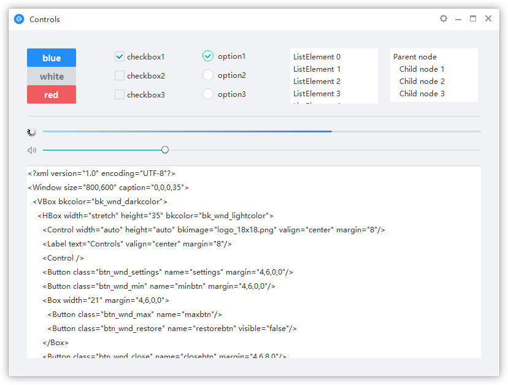

# NIM Duilib
本版本基于网易官方May 22修改，不代表官方版本，若有侵权，请告知。

NIM Duilib 包含了一整套桌面软件的开发部件，与其说这是一个界面库，不如说它是一个开发框架。从原有 Duilib 基础上拓展了一些新的能力，并整合了 Google base 基础类库（线程、内存、闭包等）。您完全可以直接使用这个框架来开发任何你想要的桌面应用。

[English](README_en-US.md)

## 特色

 - 多国语言支持
 - 通用样式支持
 - DPI 缩放支持
 - GIF 动画支持
 - CEF 控件支持（移植到3809，不再支持 XP）
 - 触控设备支持（Surface、Wacom）
 - 抽象渲染接口（为其他渲染引擎提供支持）
 
## 此版主要变化
 - CEF升级到3809
 - 简易窗口可直接通过GetSkinText载入，无须定义资源文件
 - 解决zip加密压缩包中部分文件因未压缩导致无法读取完成的bug
 - 修复不使用离屏渲染时偶尔出现窗口不显示背景阴影的bug
 - CEF初始化时加入自定义协议注册回调、命令行指令回调等，便于应用中进行自定义
 - 加入json支持，加入httplib。

## 预览

## 开始

下载或克隆项目到你的磁盘中

进入 `NIM_Duilib_Framework/samples` 目录，使用 Visual Studio 2013 Update 5 以上版本 IDE 打开 `samples.sln`，按下 F7 即可编译所有示例程序

## 文档

 - [中文文档](docs/SUMMARY.md)

## 目录

├─`bin` 各个示例程序输出目录，包含预设的皮肤和语言文件以及 CEF 依赖  
├─`docs` duilib 接口的说明文档  
├─`libs` 静态库编译后的输出目录，包含预设的一些 CEF 组件静态库  
├─`samples` 各类示例程序  
├─`third_party` 第三方库，目前仅有 cef_control 有依赖  
├─`toolkits`       
│  ├─`base` 基础类库  
│  ├─`duilib` duilib 核心代码，依赖 base 但不依赖 shared  
│  ├─`shared` 包含一些工具的封装，如命令行解析、日志、路径处理等  
│  ├─`ui_components` 基于 duilib 封装的常用组件库如 `msgbox`、`toast`、`cef_control` 等  

## 交流

 - 遇到问题：欢迎查看我们整理过的[中文文档](docs/SUMMARY.md)参考[示例程序](samples/README.md)来帮助你解决疑惑
 - 提交缺陷：在确保使用最新版本依然存在问题时请尽量以简洁的语言描述清楚复现该问题的步骤并提交 issue
 - 功能建议：如果你有什么好的想法或者提案，欢迎提交 issue 与我们交流
